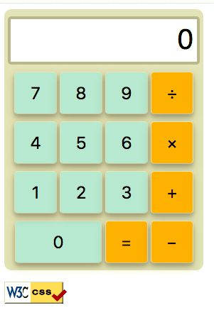

# Homework 1

This homework is the first part of a three-part homework sequence in which you 
will build a calculator application. For this first assignment, you will only 
build the front end user interface for the calculator. In the later assignments 
you will make the calculator work. 

## Specifications

The following **required** functionality is completed:

* [X] The calculator will contain 15 clickable buttons: a button for each digit 0 to 9, and +, -, ×, ÷, and =
* [X] Buttons must have rounded corners.
* [X] Digit buttons must by a different color than other buttons.
* [X] Your calculator should display a single integer value that
the user may not directly edit. For this homework, the value
is zero.
* [] When the user hovers over a button, its color must change.

The following **optional** features are implemented:

## Screenshot

## Goal

● Use Git and GitHub to correctly submit the homework.

● Gain experience with a modern version control system (Git) and practice documented
incremental development with Git commit (and commit messages).

● Create a front end for a small-scale application with correct
usage of HTML and CSS.

## References

- [Colors](https://www.w3schools.com/cssref/css_colors.asp)
- [Template README](https://raw.githubusercontent.com/kimberlyljx/Twitter/master/README.md) - Used old README as template

## License

    Copyright [2018] [KIMBERLY LIM JINXIA]

    Licensed under the Apache License, Version 2.0 (the "License");
    you may not use this file except in compliance with the License.
    You may obtain a copy of the License at

        http://www.apache.org/licenses/LICENSE-2.0

    Unless required by applicable law or agreed to in writing, software
    distributed under the License is distributed on an "AS IS" BASIS,
    WITHOUT WARRANTIES OR CONDITIONS OF ANY KIND, either express or implied.
    See the License for the specific language governing permissions and
    limitations under the License.